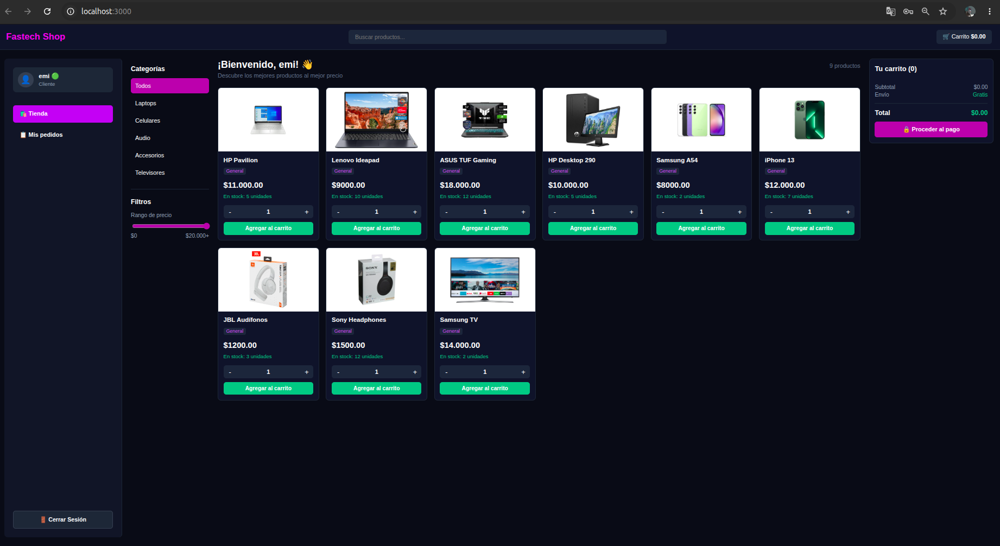

# ⚡ InventarioPro Platform

<p align="center">
  
</p>

<p align="center">
  
  
  
  
  
</p>

---

# 📖 Descripción General

InventarioPro es una solución de software empresarial Full-Stack diseñada para la gestión centralizada de almacenes, el control operativo de stock en tiempo real y el análisis de transacciones comerciales mediante un ecosistema informático unificado.

El sistema implementa una arquitectura desacoplada basada en una API RESTful y persistencia de datos relacional sobre MariaDB, lo que garantiza la integridad referencial y auditorías operativas automatizadas del negocio.

La plataforma integra:
- Panel Administrativo de Control (Dashboard General)
- Gestión de Catálogo de Productos (CRUD Completo)
- Módulo de Caja Dinámica (Carrito de Compras y Ventas)
- Bitácora Avanzada de Auditorías con Registro de Eventos
- Sistema de Control de Acceso y Sesión de Usuarios
- Sincronización Local Multipantalla (Laptop y Dispositivos Móviles)
# 📸 Documentación Visual del Sistema

# 🛒 Módulo Comercial — Vista Cliente e Inventario

---

## 1️⃣ Sistema de Control de Acceso Operativo (Autenticación)

Interfaz de seguridad perimetral para la validación de credenciales operativas del administrador y usuarios estándar. Controla el acceso directo al ecosistema del ERP protegiendo las rutas privadas mediante el puerto del servidor.

<p align="center">
  
</p>

---

## 2️⃣ Catálogo General de Productos

El sistema renderiza dinámicamente las tarjetas de los productos registrados en la base de datos MariaDB mostrando la disponibilidad de artículos, códigos de identificación, precios y stock en tiempo real.

<p align="center">
  
</p>

---

## 3️⃣ Interfaz de Gestión y Navegación de Mercancías

Menú interactivo del catálogo operativo adaptado para buscar, verificar, filtrar y seleccionar las diferentes filas del almacén de datos antes de realizar modificaciones.

<p align="center">
  
</p>

---

## 4️⃣ Módulo de Caja y Procesamiento Transaccional

Punto de venta y caja dinámica estructurada para procesar el flujo asíncrono de bajas, cálculos financieros instantáneos y la adición automatizada de productos seleccionados al carrito.

<p align="center">
  
</p>

---

# 📦 Panel Administrativo (ERP Dashboard)

---

## 5️⃣ Dashboard Financiero y Analítica Comercial

El panel analítico principal consolida la salud operativa del negocio, presentando estadísticas e indicadores KPI automatizados como el valor total de la inversión del almacén y alertas de stock crítico.

<p align="center">
  
</p>

---

## 6️⃣ Control Centralizado de Altas e Inserción de Productos

Formularios dinámicos validados que se conectan directamente al backend para registrar nuevas mercancías asignándoles stock inicial, nombres de identificación, costos y categorías lógicas.

<p align="center">
  
</p>

---

## 7️⃣ Ventanas Emergentes de Actualización Segmentada de Stock

Modales interactivos integrados dentro de la interfaz administrativa diseñados para la reconfiguración veloz, edición de atributos específicos o el reabastecimiento unitario de existencias.

<p align="center">
  
</p>

---

# 🔐 Seguridad y Auditoría

---

## 8️⃣ Bitácora de Sesiones y Auditoría Forense del Sistema

Módulo de seguridad avanzado que audita de forma interna e inalterable cada acción del sistema (`CREAR`, `EDITAR`, `ELIMINAR`), registrando el operador encargado, la fecha exacta y la IP del dispositivo cliente.

<p align="center">
  
</p>

---

# 🛠️ Especificación Técnica del Stack

## 🖥️ Frontend (SPA)
- **React.js** → Arquitectura basada en componentes reutilizables y manejo de estados dinámicos.
- **React Scripts** → Entorno de compilación y empaquetado optimizado para el servidor cliente.
- **CSS3 Personalizado** → Interfaz responsiva con temática oscura (*Dark Mode*) estilizada para entornos de administración y ERP.
- **Fetch API** → Consumo asíncrono de los endpoints expuestos por la API REST del backend.

## ⚙️ Backend (REST API)
- **Node.js** → Entorno de ejecución asíncrono de JavaScript en el servidor.
- **Express.js** → Framework modular para el enrutamiento y gestión de peticiones HTTP.
- **Cors** → Mecanismo de seguridad perimetral para habilitar el intercambio de recursos de origen cruzado.
- **Express Static Middleware** → Despliegue y entrega de recursos físicos y assets multimedia desde el servidor.

## 🗄️ Base de Datos
- **MariaDB Server** → Motor de almacenamiento transaccional para la persistencia de datos.
- **Integridad Referencial** → Restricciones avanzadas mediante Llaves Foráneas (`FOREIGN KEY`) para resguardar el historial relacional de ventas y detalles.
- **Consultas Agregadas** → Inyección de queries complejos (`SUM`, `COUNT`, `GROUP BY`) para la automatización de KPIs analíticos en el panel principal.

---

# 📂 Arquitectura del Proyecto

```text
📁 InventarioPro/
├── 📁 backend/
│   ├── 📁 public/
│   │   └── 📁 assets/
│   │       └── 📁 productos/ # Almacenamiento físico de imágenes de productos
│   ├── 📁 uploads/           # Cargas auxiliares del servidor
│   └── 📄 server.js          # Punto de entrada de la API REST y Endpoints
│
├── 📁 frontend/
│   ├── 📁 src/
│   │   ├── 📁 components/    # Componentes modulares (Carrito, ListaProductos, etc.)
│   │   ├── 📁 assets/
│   │   │   └── 📁 evidencias/# Capturas de pantalla utilizadas en la documentación
│   │   ├── 📄 App.js         # Enrutamiento y lógica principal del cliente React
│   │   ├── 📄 Login.jsx      # Control de acceso e inicio de sesión
│   │   └── 📄 index.css      # Estilos generales de la interfaz
│   │
│   └── 📁 public/
│       ├── 📄 index.html     # Plantilla de renderizado HTML5
│       └── 📄 favicon.ico    # Icono de la pestaña del sistema
│
└── 📄 README.md