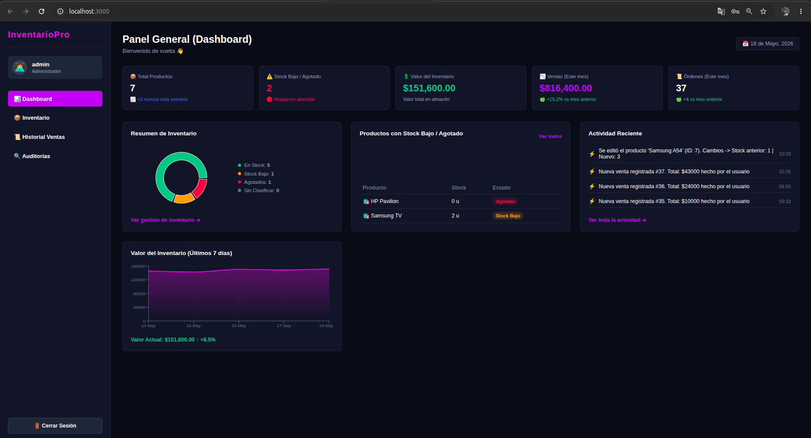
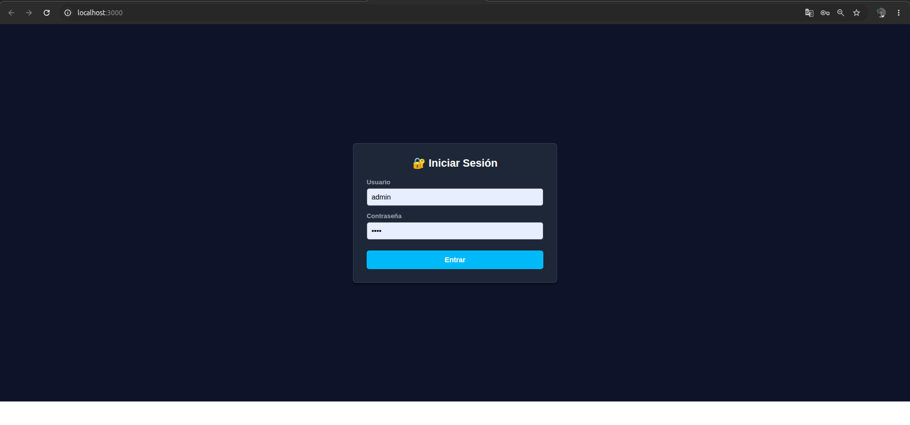
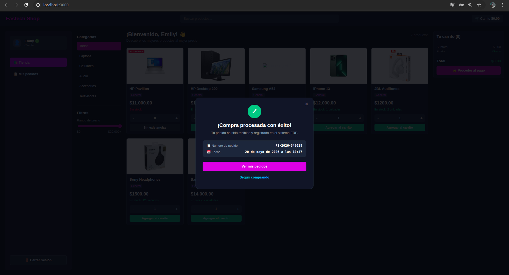
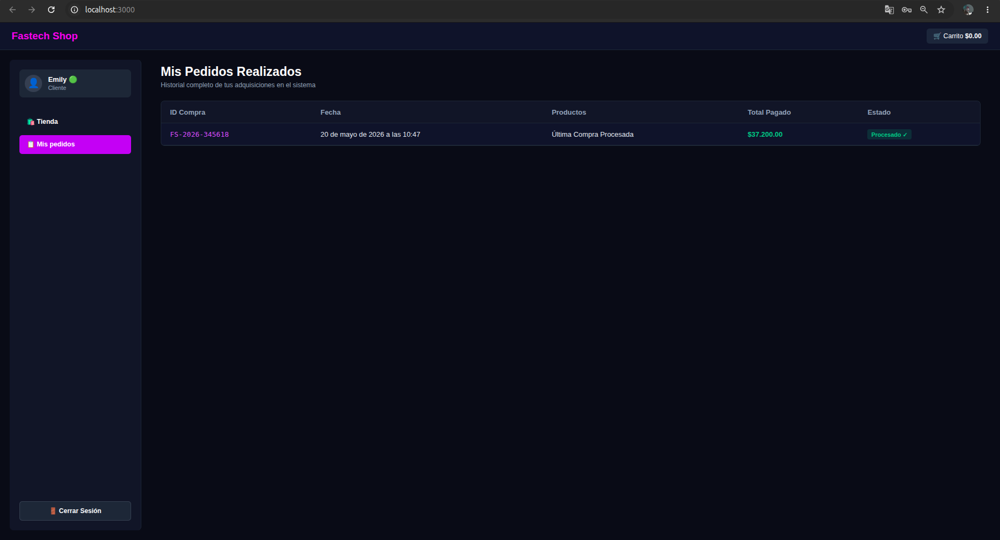
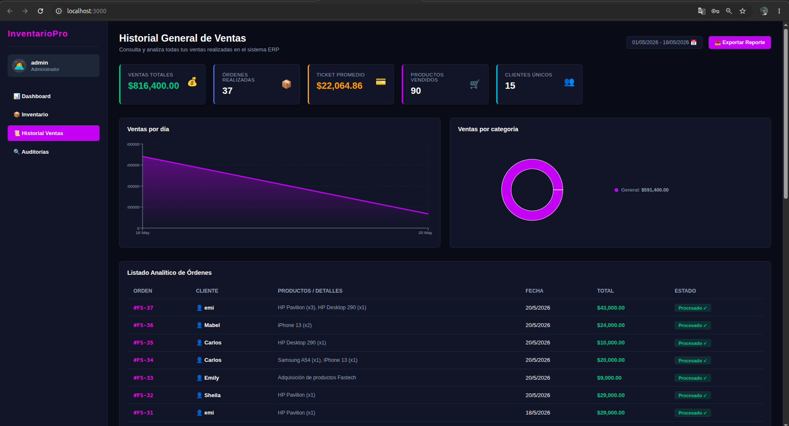
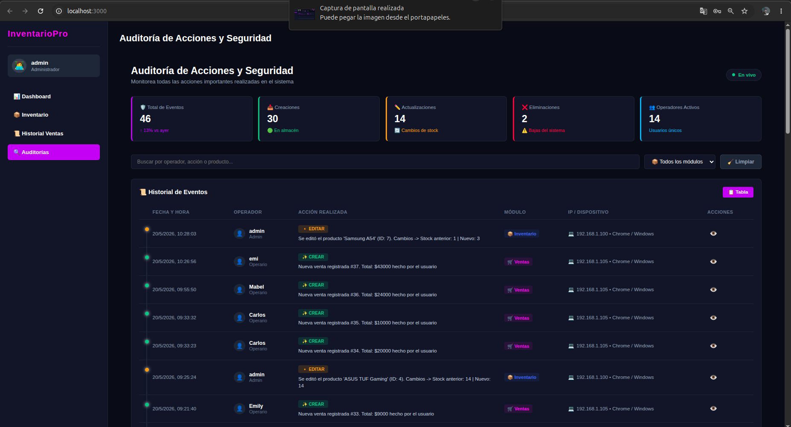

# ⚡ InventarioPro

  

---

## 📖 Descripción General
**InventarioPro** es una plataforma de gestión empresarial desarrollada para optimizar el control de existencias, automatizar el punto de venta y centralizar la toma de decisiones financieras. A diferencia de soluciones básicas, este sistema garantiza **integridad transaccional** gracias al uso del motor InnoDB en MariaDB, permitiendo que cada movimiento de inventario esté perfectamente respaldado por auditorías en tiempo real.

El proyecto se basa en una arquitectura **Cliente-Servidor desacoplada**, donde el frontend consume una API REST centralizada, permitiendo que múltiples dispositivos en una red local (LAN) accedan a la misma base de datos sin conflictos de concurrencia.

---

## 🛠️ Especificaciones Técnicas y Lógica

### 🖥️ Frontend (SPA - Single Page Application)
- **React.js & Hooks:** Utilizamos `useState` y `useEffect` para mantener la interfaz sincronizada con el servidor sin recargas de página.
- **Comunicación Asíncrona:** La integración de `Fetch API` permite consultar el stock, enviar transacciones de venta y actualizar registros de forma inmediata.
- **Diseño Adaptativo:** Implementación de un sistema de estilos CSS3 orientado a la legibilidad en entornos de almacén, priorizando el contraste y la organización visual de datos.

### ⚙️ Backend (API REST)
- **Node.js & Express:** Servidor de alto rendimiento que gestiona las peticiones mediante rutas (endpoints) protegidas.
- **Seguridad perimetral:** Implementación de políticas **CORS** para asegurar el intercambio de datos entre el cliente y el servidor.
- **Gestión de Recursos:** El backend actúa como un orquestador que valida el stock antes de confirmar cualquier venta, evitando ventas en negativo.

### 🗄️ Base de Datos: La columna vertebral
El sistema utiliza **MariaDB** bajo un modelo relacional estricto. La lógica se sustenta en:
1. **Transacciones:** Si una venta falla, el inventario nunca se descuenta (integridad garantizada).
2. **Consultas Agregadas:** En lugar de procesar cálculos en el frontend, el backend solicita a la base de datos valores calculados (`SUM`, `COUNT`), lo que reduce drásticamente el consumo de memoria.

---

## 📸 Documentación Visual del Sistema

### 1. Sistema de Control de Acceso (Login)
*La puerta de entrada al sistema.* Gestiona el nivel de privilegios y asegura que solo personal autorizado pueda realizar operaciones de inventario o visualizar reportes financieros.

  

### 2. Catálogo e Interfaz de Bienvenida
*Visualización de activos.* Aquí se despliegan los productos disponibles con su respectiva información de stock. La interfaz está diseñada para un escaneo visual rápido.

  

### 3. Módulo de Caja y Transacciones (Compra)
*El núcleo operativo.* Al realizar una venta, el sistema realiza una consulta atómica que verifica la disponibilidad del producto y descuenta el stock de manera instantánea.

  

### 4. Historial Operativo de Pedidos
*Trazabilidad.* Permite auditar qué se vendió, cuándo y por qué operador, proporcionando un historial claro de todas las salidas de almacén.

  

### 5. Dashboard Financiero y Analítica
*Inteligencia de negocios.* Aquí se traduce la data cruda en información útil: ¿Qué productos se venden más? ¿Cuál es el valor total del inventario? ¿Cuáles son los artículos con stock crítico?

  

### 6. Control Centralizado de Inventario (CRUD)
*Administración maestra.* Permite al administrador realizar altas, bajas y modificaciones en la base de datos de productos de forma segura y validada.

  

### 7. Bitácora de Auditoría Forense
*Transparencia absoluta.* Cada cambio realizado en la base de datos queda registrado. Esta bitácora es esencial para detectar errores humanos o intentos de manipulación de registros.

  

---

## 🚀 Despliegue y Ejecución

Para poner en marcha el sistema, asegúrate de tener instalado **Node.js (LTS)** y **MariaDB**.

**1. Configuración de Base de Datos:**
Importa el archivo `.sql` en MariaDB. Esto creará las tablas necesarias con todas las relaciones y restricciones configuradas.

**2. Ejecución:**
- **Backend:** `cd backend` -> `npm install` -> `npm start`
- **Frontend:** `cd frontend` -> `npm install` -> `npm start`

---

## 👨‍💻 Autoría
Desarrollado por **Emily Jazmin Cruz Rojas**. Este proyecto demuestra competencias clave en la arquitectura de software empresarial, gestión de bases de datos relacionales y desarrollo de interfaces de usuario funcionales.